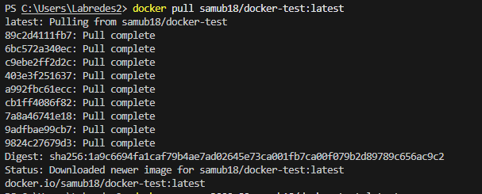
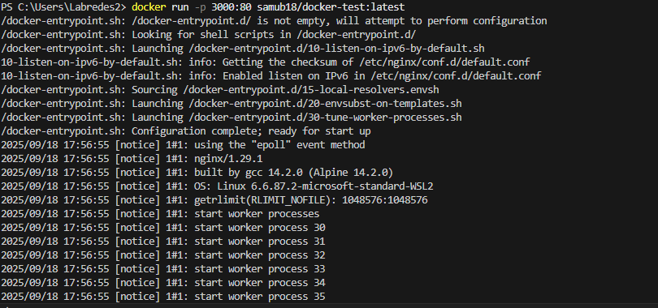
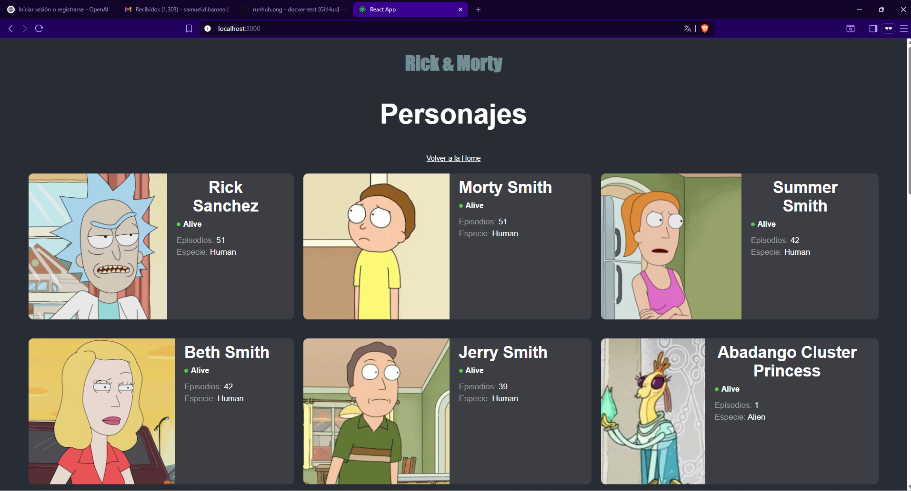
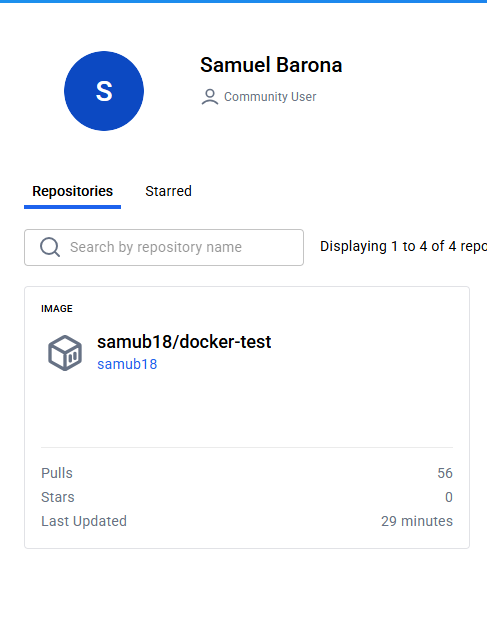
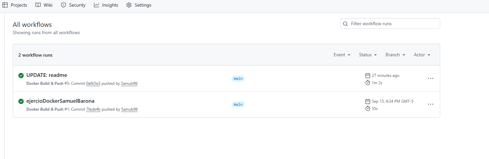

# Informe – Proyecto Docker Test

##  Descripción
Este proyecto corresponde a una prueba de integración continua (CI) para **dockerizar** una aplicación React y automatizar la construcción y publicación de la imagen en **Docker Hub** utilizando **GitHub Actions**.  

El objetivo principal es demostrar el ciclo completo:  
1. Construcción de la imagen.  
2. Uso de múltiples etapas en Docker para optimización.  
3. Publicación automática en un registro externo (Docker Hub).  

---

##  Estructura del proyecto
```
.
├── public/                 # Archivos estáticos de React
├── src/                    # Código fuente de la aplicación
├── Dockerfile              # Definición de la imagen Docker
├── .dockerignore           # Archivos ignorados en la build
├── .github/workflows/      # Configuración de CI/CD
│   └── docker-build.yml
├── package.json
└── README.md
```

---

##  Dockerfile
El contenedor se construye en dos etapas:  

1. **Etapa de build**  
   - Imagen base: `node:18-alpine`  
   - Instala dependencias y ejecuta `npm run build`.  

2. **Etapa de producción**  
   - Imagen base: `nginx:alpine`  
   - Copia los archivos compilados al directorio de Nginx.  
   - Expone el puerto `80`.  

---

##  GitHub Actions
El flujo de CI/CD (`.github/workflows/docker-build.yml`) realiza:  
1. **Checkout** del código.  
2. Configuración de **Docker Buildx**.  
3. **Login en Docker Hub** usando secretos de GitHub (`DOCKER_USERNAME` y `DOCKER_PASSWORD`).  
4. **Build y Push** de la imagen con el tag:  
   ```
   samub18/docker-test:latest
   ```

---

## Configuración de secretos
En GitHub → `Settings > Secrets and variables > Actions` se deben definir:  

- `DOCKER_USERNAME`: usuario de Docker Hub.  
- `DOCKER_PASSWORD`: contraseña o token de acceso de Docker Hub.  

---

##  Ejecución local
### Construcción manual
```bash
docker build -t docker-test .
```

### Ejecución
```bash
docker run -p 3000:80 docker-test
```

Acceder en el navegador a:  
[http://localhost:3000](http://localhost:3000)  





---

##  Validación del CI/CD
1. Confirmar en **GitHub Actions** que el workflow corre exitosamente al hacer `git push` en la rama `main`.  
2. Verificar en **Docker Hub** que la imagen `docker-test:latest` aparece publicada.  
3. Descargar y correr la imagen directamente desde Docker Hub:  
   ```bash
   docker pull samub18/docker-test:latest
   docker run -p 3000:80 samub18/docker-test:latest
   ```
   


---

## Resultados
- Se logró empaquetar la aplicación React en una imagen ligera con Nginx.  
- El pipeline de GitHub Actions permite automatizar la construcción y despliegue.  
- La imagen final es portable y puede ejecutarse en cualquier entorno con Docker.  
